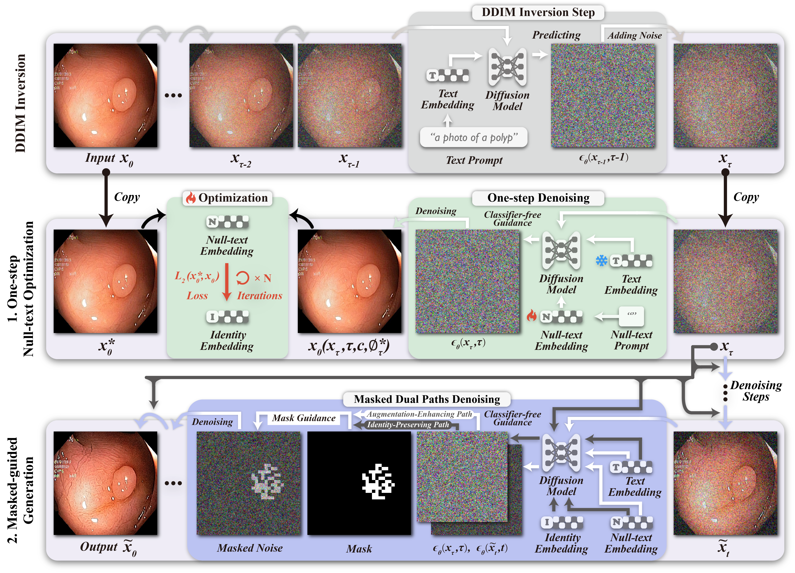

# Test-Time Generative Augmentation (TTGA)

This is the official repository for "Test-Time Generative Augmentation for Medical Image Segmentation"

## Introduction
Test-Time Generative Augmentation (TTGA) is a novel approach to enhance medical image segmentation during test time. Instead of employing handcrafted transforms or functions on the input test image to create multiple views for test-time augmentation, this approach advocate for the utilization of an advanced domain-fine-tuned generative model, e.g., diffusion models, for test-time augmentation. Hence, by integrating the generative model into test-time augmentation, we can effectively generate multiple views of a given test sample, aligning with the content and appearance characteristics of the sample and the related local data distribution.

## Augmentation

## Citing
TO-DO.
