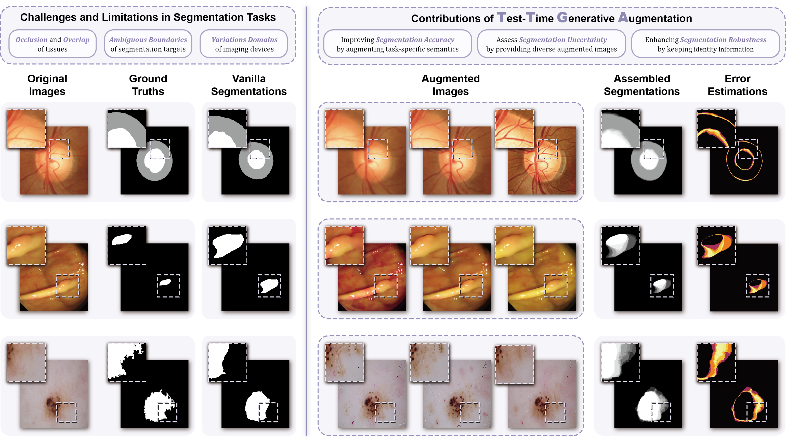

# Test-Time Generative Augmentation (TTGA)

This is the official repository for "[Test-Time Generative Augmentation for Medical Image Segmentation](https://arxiv.org/abs/2406.17608)"

## Introduction
Test-Time Generative Augmentation (TTGA) is a novel approach to enhance medical image segmentation during test time. Instead of employing handcrafted transforms or functions on the input test image to create multiple views for test-time augmentation, this approach advocate for the utilization of an advanced domain-fine-tuned generative model, e.g., diffusion models, for test-time augmentation. Hence, by integrating the generative model into test-time augmentation, we can effectively generate multiple views of a given test sample, aligning with the content and appearance characteristics of the sample and the related local data distribution.

## Augmentation
:sparkles: Optic Disc and Cup Segmentation

  
   

:sparkles: Polyp Segmentation

  
   

:sparkles: Skin Lesion Segmentation

  
   

## Materials
:two_hearts: SOTA segmentation models with codes, datasets and open-source parameters. (Thanks!)

| Index | Physiology         | Dataset  | Paper    | Code |
| :----:| :----:             | :----:   | :----:   |:----:|
| 1     | Optic Disc and Cup | [REFUGE20](https://refuge.grand-challenge.org/Download/) | [Segtrain](https://arxiv.org/pdf/2105.09511)|[code](https://github.com/askerlee/segtran/)|
| 2     | Polyp              | [Kvasir](https://datasets.simula.no/kvasir/) [CVC-ClinicDB](https://www.kaggle.com/datasets/balraj98/cvcclinicdb) [CVC-ColonDB](http://mv.cvc.uab.es/projects/colon-qa/cvc-colondb) [CVC-300](http://adas.cvc.uab.es/endoscene) [ETIS-LaribPolypDB](https://www.kaggle.com/datasets/nguyenvoquocduong/etis-laribpolypdb) | [HSNet](https://www.sciencedirect.com/science/article/abs/pii/S0010482522008812?fr=RR-2&ref=pdf_download&rr=89939d365e6984b1)|[code](https://github.com/baiboat/HSNet/)|
| 3     | Skin Lesion        | [ISIC 2017](https://challenge.isic-archive.com/data/#2017) [ISIC 2018](https://challenge.isic-archive.com/data/#2018) | [TMUnet](https://arxiv.org/pdf/2203.01932)|[code](https://github.com/rezazad68/TMUnet/)|

## Citing
TO-DO.
